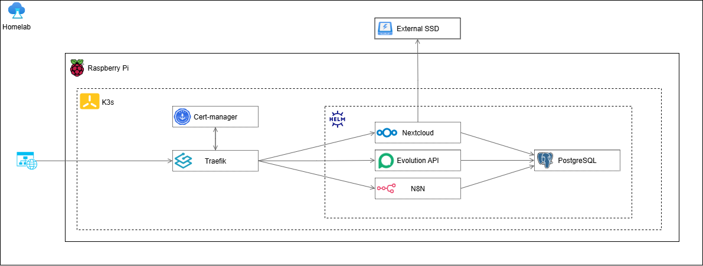

# Homelab K3s

A personal home lab project designed to consolidate practical skills in **Kubernetes (k3s)**, **Helm**, **DevOps**, automation, and self-hosting. Inspired by platforms like CasaOS and Umbrel, but with full control via infrastructure as code and open-source tools. This project runs on a Raspberry Pi 4 (8GB RAM) and leverages Helm charts for modular, reproducible deployments.



---

## Table of Contents

- [Project Overview](#project-overview)
- [Features](#features)
- [Tech Stack](#tech-stack)
- [Directory Structure](#directory-structure)
- [Setup Instructions](#setup-instructions)
- [Usage](#usage)
- [References](#references)

---

## Project Overview

This project aims to create a modular, extensible, and reproducible home infrastructure using k3s and Helm. It automates daily tasks, hosts personal services, and integrates workflows (e.g., Telegram bots, cloud storage, WhatsApp API) on local hardware.

---

## Features

- **Kubernetes (k3s)**: Lightweight, production-grade Kubernetes for edge devices.
- **Helm**: Declarative application management and deployment.
- **n8n**: Workflow automation and integration (e.g., Telegram bots).
- **Nextcloud**: Personal cloud storage.
- **PostgreSQL**: Centralized database for services.
- **Cert-Manager**: Automated TLS certificate management with Let's Encrypt.
- **Traefik**: Ingress controller with dynamic routing and TLS.
- **evolution-api**: WhatsApp API for custom automations.

---

## Tech Stack

- **k3s** (Kubernetes)
- **Helm**
- **n8n**
- **Nextcloud**
- **PostgreSQL**
- **Cert-Manager**
- **Traefik**
- **evolution-api**
- **Raspberry Pi 4 (8GB RAM)**

---

## Setup Instructions

### 1. Prerequisites

- Raspberry Pi 4 (8GB RAM recommended)
- k3s installed and running
- `kubectl` and `helm` installed on your workstation

### 2. Deploy Cert-Manager CRDs

Required for automatic TLS certificate issuance with Let's Encrypt:

```bash
kubectl apply -f https://github.com/jetstack/cert-manager/releases/download/v1.12.16/cert-manager.yaml
```

### 3. Deploy Traefik Middleware and ClusterIssuer

```bash
kubectl apply -f specs/ssl/middleware.yaml
kubectl apply -f specs/ssl/cluster-issuer.yaml -n cert-manager
```

### 4. Install Helm Dependencies

```bash
cd specs/chart
helm dependency update
```

### 5. Deploy the Homelab Chart

```bash
helm upgrade --install homelab-k3s -f values.yaml . --history-max 1
```
### 6. Create Required Secrets

Before installing the chart, create the necessary Kubernetes secrets required by the dependencies (such as database passwords, API tokens, etc). For example:

```bash
kubectl create secret generic nextcloud-secrets --from-literal=nextcloud-password=<YOUR_PASSWORD>
```

Adjust the names and values as needed for each service.

### 7. Adjust the `values.yaml` File

Edit the `values.yaml` file to configure domains, credentials, service options, and integrations according to your environment.

## Usage

- **n8n**: Access via `https://n8n.<your-domain>:8443/`
- **Nextcloud**: Access via `https://drive.<your-domain>/`
- **PostgreSQL**: Used internally by services
- **evolution-api**: Exposed on configured port for WhatsApp integrations

You can customize workflows (e.g., Telegram bots) by editing files in `n8n-flows/` and importing them into your n8n instance.

---

## References

- [k3s Documentation](https://rancher.com/docs/k3s/latest/en/)
- [Helm Documentation](https://helm.sh/docs/)
- [n8n Documentation](https://docs.n8n.io/)
- [Nextcloud Helm Chart](https://github.com/nextcloud/helm)
- [Cert-Manager](https://cert-manager.io/)
- [Traefik](https://doc.traefik.io/traefik/)
- [evolution-api](https://github.com/joaomarcuslf/evolution-api)

---

## Notes

- Make sure your DNS is configured for all required subdomains.
- Cert-Manager and Traefik must be running for automatic HTTPS.
- All sensitive credentials should be managed via Kubernetes secrets.

---

Happy hacking!
